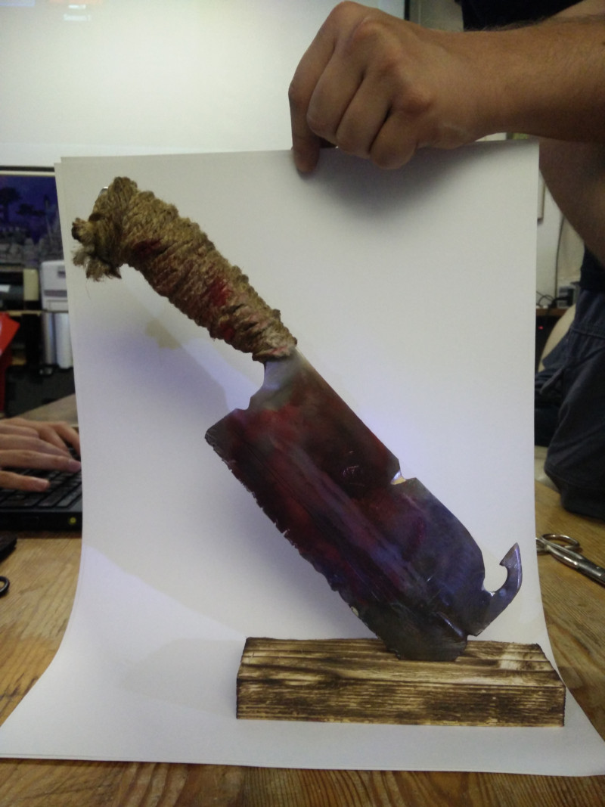

# Fresh Meat

The starting logo for this project was just some crappy clipart which had a
suitable license, and since my GIMP skills aren't that great, it ended up
looking dull.

Something more *realistic* was needed, but how to achieve... I ended up
ordering a cheap (made in China) [cleaver off of Amazon][1] and *enhanced* it a
little with the help of a friend. We used the workshop of our [local
Hackerspace][2] --- didn't take much time but it was a blast, and the end
result looks quite astonishing.

[1]: <https://www.amazon.de/dp/B00GAZRZHA>
[2]: <https://it-syndikat.org/>
